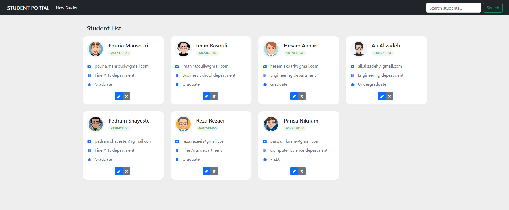

# StudentPortal
A web application for storing and retrieving student information

<h1 align="left"> Student Portal </h1>
<!--  -->

<!--  -->

<p align="justify"> 
The main objective of this project is to detect discriminating features in an image and find the best matching features in other images. Because features should be reasonably invariant to translation, rotation, and illumination.
</p>

<!-- TABLE OF CONTENTS -->
<h2 id="table-of-contents"> Table of Contents</h2>
  <ol>
    <li><a href="#prerequisites"> Prerequisites </a></li>
    <li><a href="#HowToUse"> How to Use </a></li>
    <li><a href="#credits"> Credits </a></li>
  </ol>

<!--  -->

<!-- PREREQUISITES -->
<h2 id="prerequisites">Prerequisites</h2>

<p align="center">
  <a href="https://angular.io/" target="_blank">
      
  </a>
  <a href="https://spring.io/" target="_blank">
      
  </a>
  <a href="https://www.postgresql.org/" target="_blank">
      
  </a>
  <a href="https://www.java.com/en/" target="_blank">
      
  </a>
  <a href="https://nodejs.org/en/" target="_blank">
      
  </a>
  <a href="https://html.com/" target="_blank">
      
  </a>
  <a href="https://www.javascript.com/" target="_blank">
      
  </a>
  <a href="https://www.w3schools.com/cssref/index.php" target="_blank">
      
  </a>
  <a href="https://getbootstrap.com/docs/4.0/getting-started/introduction/" target="_blank">
      
  </a>
  <a href="https://www.docker.com/" target="_blank">
      
  </a>
<P/>

<!-- How to Use -->
<h2 id="HowToUse"> How to Use </h2>

<p align="justify">
      * Step 1. Download Code as Zip OR <br> 

```
git clone https://github.com/ma-shamshiri/Face-Mask-Detection.git
```

<b>Step 2.</b> Create a new virtual environment
```
python -m venv tfod #window
virtualenv tfod #Linux
```

<b>Step 3.</b> Activate your virtual environment
```
source tfod/bin/activate # Linux
.\tfod\Scripts\activate # Windows 
```

<b>Step 4.</b> Install dependencies and add virtual environment to the Python Kernel
```
python -m pip install --upgrade pip
pip install ipykernel
python -m ipykernel install --user --name=tfodj
```

<b>Step 5.</b> Collect images and ensure you change the kernel to the virtual environment.

<b>Step 6.</b> Manually divide collected images into two folders train and test. So now all folders and annotations should be split between the following two folders. <br>
```
workspace\images\train
workspace\images\test
```

<b>Step 7.</b> Begin training process by opening 2. Training and Detection.ipynb, this notebook will walk you through installing Tensorflow Object Detection, making detections, saving and exporting your model.

<b>Step 8.</b> During this process the Notebook will install Tensorflow Object Detection. You should ideally receive a notification indicating that the API has installed successfully at Step 8 with the last line stating OK.
</p> 


<!-- CREDITS -->
<h2 id="credits"> Credits</h2>

Mohammad Amin Shamshiri

[](https://github.com/ma-shamshiri)
[](https://twitter.com/ma_shamshiri)
[](https://www.linkedin.com/in/ma-shamshiri)
